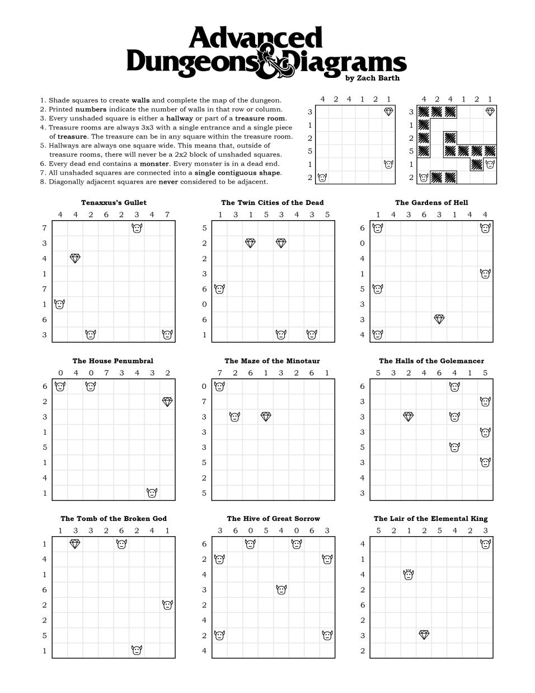

## Dungeons and Diagrams

Dungeons & Diagrams is a puzzle game wherein the player solves dungeons by marking whether a cell in the grid is either a space or a wall (see below image for rules). This project uses the z3 theorem prover by microsoft research to solve dungeons & diagrams puzzles. 


## How to run
there's two ways to run this application. You'll first have to clone the repo for both
### Natively
Install z3 and golang then
run the following command
```
go run .
```
### Docker
install docker then run the following commands
```
docker build -t dungeons-and-diagrams
docker run -it dungeons-and-diagrams
```

## Roadmap/Improvements
- Importing puzzles from the game "Last Call BBS"
- Puzzle generation
- Play dungeons & diagrams in the application
- more tests